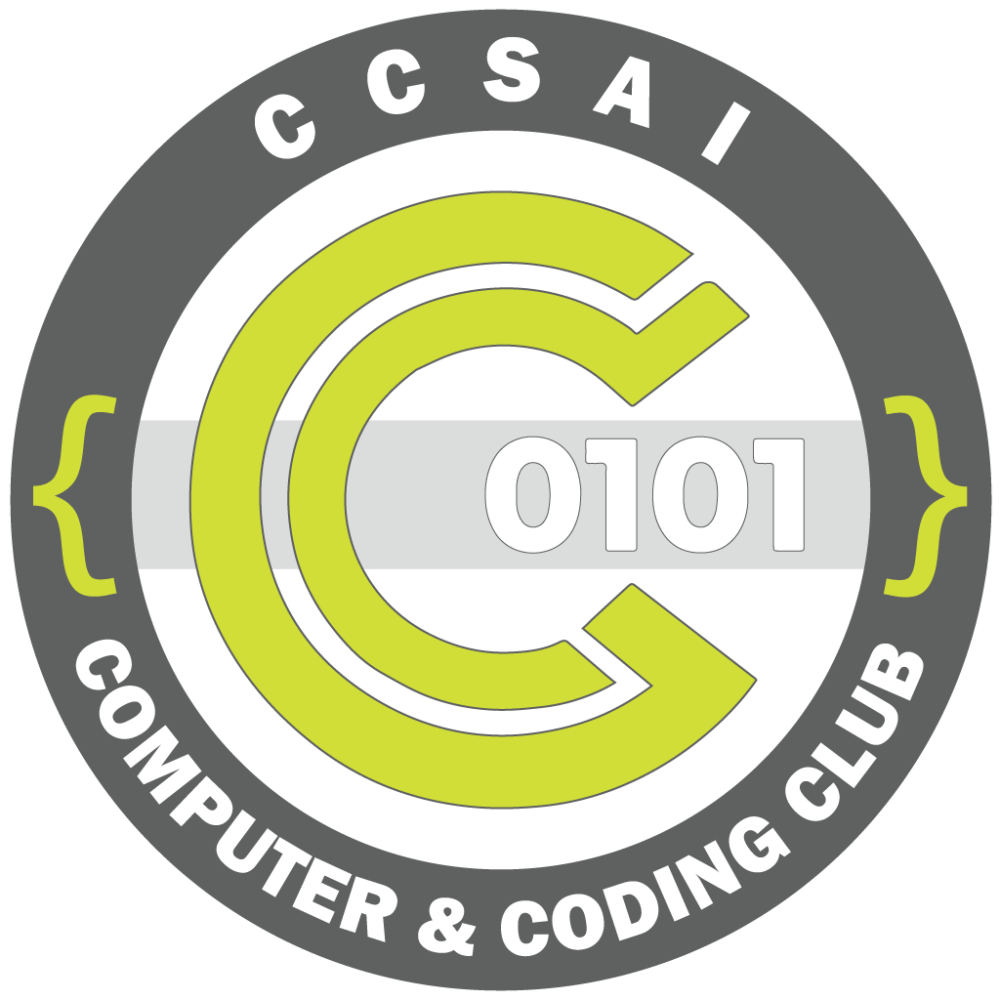

 

  

<h3 align="center">
    C5 Official Website
</h3>
  

    Source code for the official website of C5, a community-driven club at Centennial College, Toronto. This website
    is dedicated as a hub for new and existing members to learn more about the club, its events, and more.
     
    

        <a href="/url">Report Bug</a>
        ✱
        <a href="/url">Request Feature</a>
        ✱
        <a href="/url">Documentation</a>
    

  

    <!-- TODO: Add a Subsection for Badges Here -->

> [!WARNING] 
> This website is still currently under development, and is not yet ready for production use. If there are any notable bugs or issues,
> please report them ASAP to the development team or any staff at C5 to have it resolved for a better user experience. Your feedback 
> and community support is greatly appreciated.

## Table of Contents

## Features

## Getting Started

### Prerequisites

### Installation

### Usage

# License

This project is licensed under the GNU General Public License v3.0 - see the [LICENSE](LICENSE) file for details.

